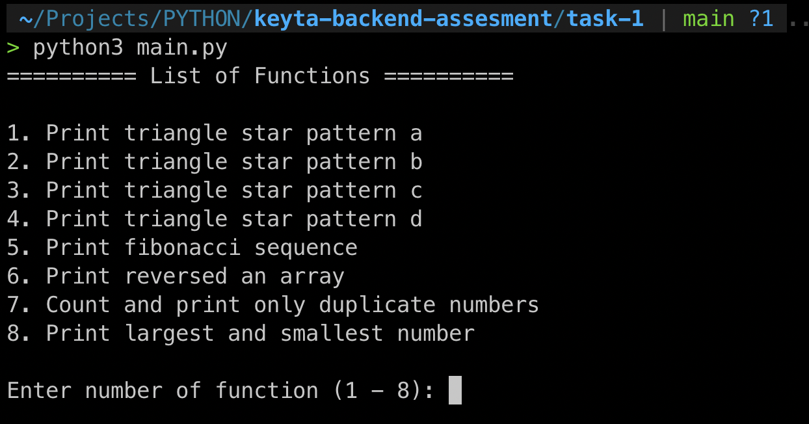
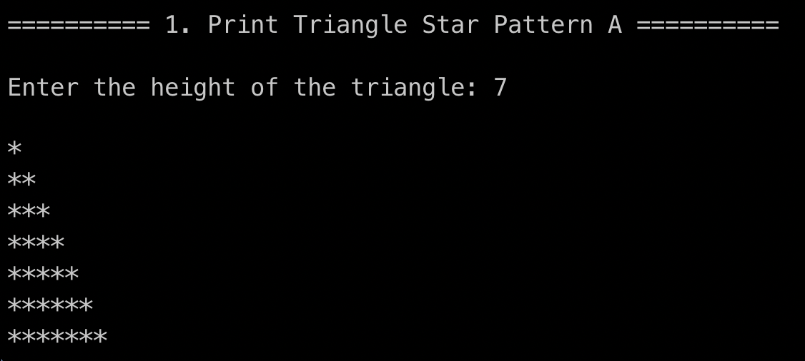
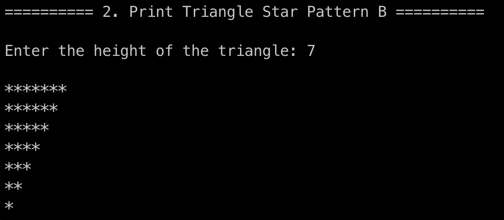
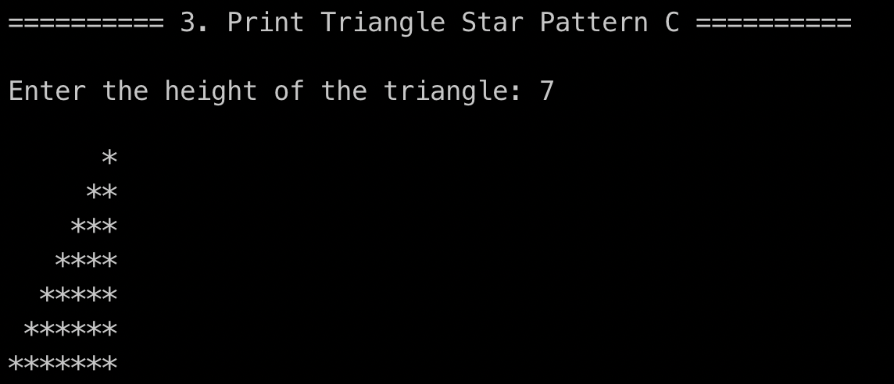
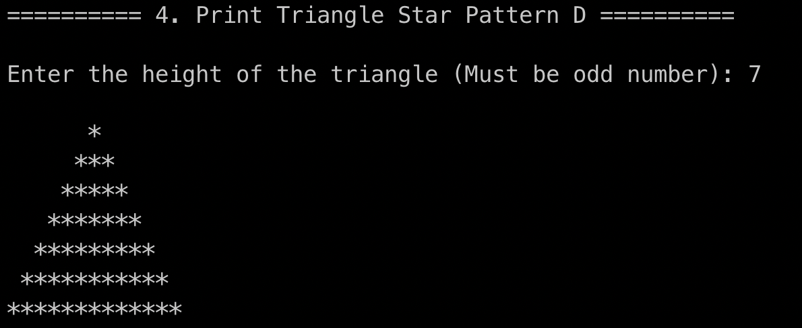
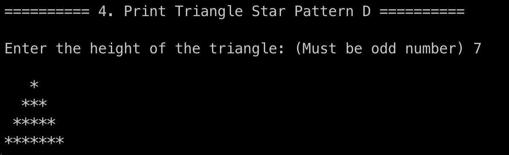
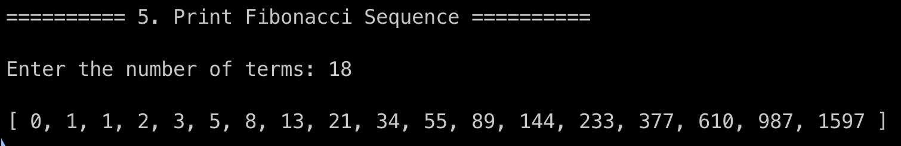
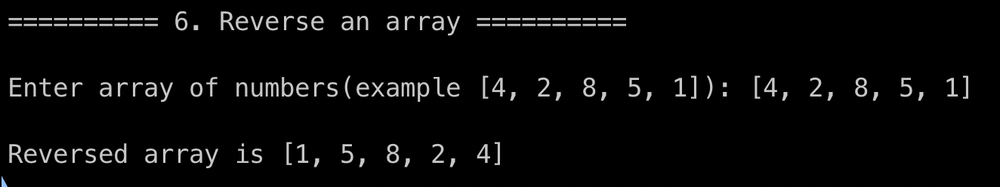
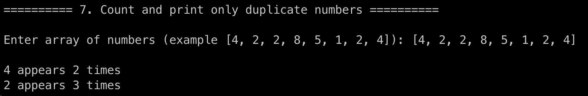
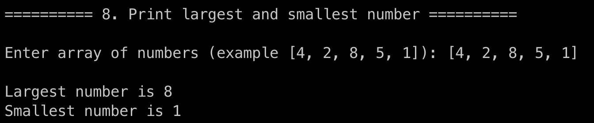

### How to run

```bash
$ python main.py
```

### Output screenshot

#### Choose menu


#### Print Triangle Star Pattern A


#### Print Triangle Star Pattern B


#### Print Triangle Star Pattern C


#### Print Triangle Star Pattern D


#### Print Fibonacci Sequence


#### Reverse an array


#### Count and print only duplicate numbers


#### Print largest and smallest number
